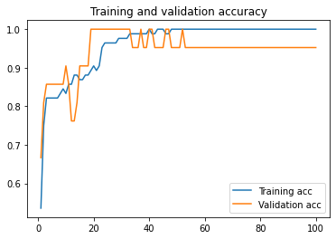
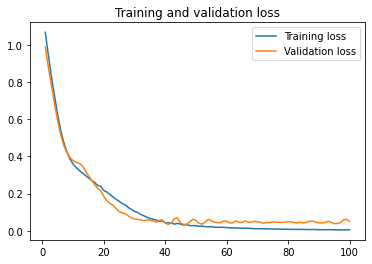
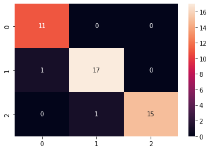
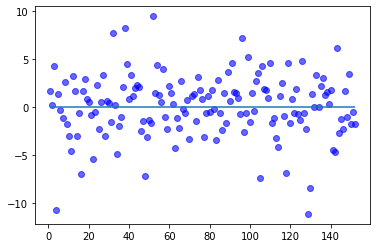

# Cheet Sheet for Basic Deep Learning Workflow

## 1. Visualize dataset


```python
df.sample(5)
```


<div>
<table border="1" class="dataframe">
  <thead>
    <tr style="text-align: right;">
      <th></th>
      <th>sepal_length</th>
      <th>sepal_width</th>
      <th>petal_length</th>
      <th>petal_width</th>
      <th>species</th>
    </tr>
  </thead>
  <tbody>
    <tr>
      <th>139</th>
      <td>6.9</td>
      <td>3.1</td>
      <td>5.4</td>
      <td>2.1</td>
      <td>virginica</td>
    </tr>
    <tr>
      <th>110</th>
      <td>6.5</td>
      <td>3.2</td>
      <td>5.1</td>
      <td>2.0</td>
      <td>virginica</td>
    </tr>
    <tr>
      <th>20</th>
      <td>5.4</td>
      <td>3.4</td>
      <td>1.7</td>
      <td>0.2</td>
      <td>setosa</td>
    </tr>
    <tr>
      <th>37</th>
      <td>4.9</td>
      <td>3.6</td>
      <td>1.4</td>
      <td>0.1</td>
      <td>setosa</td>
    </tr>
    <tr>
      <th>82</th>
      <td>5.8</td>
      <td>2.7</td>
      <td>3.9</td>
      <td>1.2</td>
      <td>versicolor</td>
    </tr>
  </tbody>
</table>
</div>

---

## 2. Divide the dataset into X and label


```python
X = df.drop('species', axis=1).values
y = df.loc[:,['species']].values
```

### TIPS: Transform the categorical data into 1/0 (One-hot encoding)


```python
from sklearn import preprocessing
lb = preprocessing.LabelBinarizer()
y = lb.fit_transform(y)
```
---

## 3. Split the dataet into Training and Testing data


```python
from sklearn.model_selection import train_test_split
X_train, X_test, y_train, y_test = train_test_split(X, y,
                                                    test_size = 0.3,
                                                    train_size = 0.7,
                                                    stratify=y,
                                                    shuffle = True)
```


```python
print(f'X_train:{X_train.shape}\n X_test:{X_test.shape}\ny_train:{y_train.shape}\n y_test:{y_test.shape}')
```

    X_train:(105, 4)
     X_test:(45, 4)
    y_train:(105, 3)
     y_test:(45, 3)

---

## 4. Data Cleansing / Scaling

### Standardization


```python
mean = X_train.mean(axis=0)
std = X_train.std(axis=0,ddof=1)
X_train = (X_train - mean)/std
```

### Min-Max Scaling


```python
mini = np.amin(X_train, axis=0)
maxi = np.amax(X_train, axis=0)
X_train = (X_train - mini)/(maxi - mini)
```
---

## 5. Build ML model


```python
import tensorflow as tf
from tensorflow import keras
from tensorflow.keras.models import Sequential
from tensorflow.keras.layers import Dense
from tensorflow.keras import optimizers
```


```python
model = Sequential()
model.add(Dense(100, input_shape=(X_train.shape[1],), activation='relu'))
model.add(Dense(100, activation='relu'))
model.add(Dense(100, activation='relu'))
model.add(Dense(num, activation='softmax/sigmoid/linear/..'))
```

### TIPS : last layer
### <font color="Blue">Classification Task</font>
If the number of class is 2 ( 0 / 1) use **Sigmoid**  
If the number of class is more than 2, then use **Softmax**
### <font color="Blue">Linear Regression Task</font>
Use **Linear**


```python
adam = optimizers.Adam(lr = 0.001)
model.compile(optimizer = adam,
             loss = 'mae/binary_crossentropy/categorical_crossentropy/..',
             metrics = ['acc'])
```

### TIPS : loss and metrics
### <font color="Blue">Classification Task</font>
If the number of class is 2 ( 0 / 1) use **binary_crossentropy**  
If the number of class is more than 2, then use **categorical_crossentropy**
### <font color="Blue">Linear Regression Task</font>  
**MSE(Mean Squared Error)**: Default for ilnear task. Sensitive to outliers.  
**MAE(Mean Absolute Error)**: Readable,Understandable for human. Not sensitive to outliers.  
**Others**: MSLE, RMSE, etc .. https://keras.io/ja/losses/


```python
history = model.fit(X_train, y_train,
                   batch_size=32,epochs=1000,
                    validation_split=0.2,
                   verbose=0)
```

### TIPS: Batch size and Learning rate
Batch size should not be too learge or too small.  
**Decreasing learning rate == Increasing batch size**  
But, incrasing batch size do the job faster  
source: thesis by google team

---

## 6. Model evaluation


```python
import matplotlib.pyplot as plt
```

```python
acc = history.history['acc']
val_acc = history.history['val_acc']
loss = history.history['loss']
val_loss = history.history['val_loss']

epochs = range(1, len(acc)+1)

plt.plot(epochs, acc, label='Training acc')
plt.plot(epochs, val_acc, label='Validation acc')
plt.title('Training and validation accuracy')
plt.legend()

plt.figure()

plt.plot(epochs, loss, label='Training loss')
plt.plot(epochs, val_loss, label='Validation loss')
plt.title('Training and validation loss')
plt.legend()

plt.show()
```


    

    


    

    


### TIPS: Find right epoch parameter  
Start with huge number, then visualize it and find the right spot.  
Train-Val acc ==> High  
Train-Val loss ==> Low  
If either of train/val is opposite, its likely that its high bias/variant

### TIPS: Overfitting. Underfitting.
If the model is overfitting(high variant):  
1. Add regularization L1(Remove some variable)/L2(Make the curve smooth)
2. Remove some dense / layer
3. Add dropout

If the model is underfitting(high bias):  
1. Make regularization smaller 
2. Add more dense / layer
3. Add training examples

---

## 7. Model Evaluation with Test Data (Generalization)


```python
X_test = (X_test - mean)/std
```


```python
# or
X_test = (X_test - mini)/(maxi - mini)
```


```python
model.evaluate(X_test,y_test)
y_pred = model.predict(X_test)
```

    2/2 [==============================] - 0s 2ms/step - loss: 0.1550 - acc: 0.9556

---

## 8. Visualize the Predicted Outcome and Test Data

### <font color="Blue">Classification Task</font>
### TIPS: Heatmap


```python
from sklearn.metrics import confusion_matrix
import seaborn as sns

y_prob = model.predict(X_test).argmax(axis=-1)

cf_matrix = confusion_matrix(y_prob, y_test.argmax(axis=-1))
sns.heatmap(cf_matrix, annot=True)
```


    <AxesSubplot:>


    

    


### TIPS: Stats metrics(F1, precision, recall, etc) 


```python
from sklearn.metrics import classification_report
print(classification_report(y_test.argmax(axis=-1), y_prob))
```

                  precision    recall  f1-score   support
    
               0       1.00      0.92      0.96        12
               1       0.94      0.94      0.94        18
               2       0.94      1.00      0.97        15
    
        accuracy                           0.96        45
       macro avg       0.96      0.95      0.96        45
    weighted avg       0.96      0.96      0.96        45
    


### <font color="Blue">Linear Regression Task</font>

### TIPS: Comparison of Test data and Predicted data in scatter


```python
y_pred = y_pred.reshape(y_pred.shape[0])
y_test = y_test.reshape(y_test.shape[0])

plt.scatter(range(1,len(y_test)+1),(y_pred - y_test), c='b', alpha=0.6)
plt.hlines(y=0,xmin=1, xmax=len(y_test))
plt.show()
```


    

    

